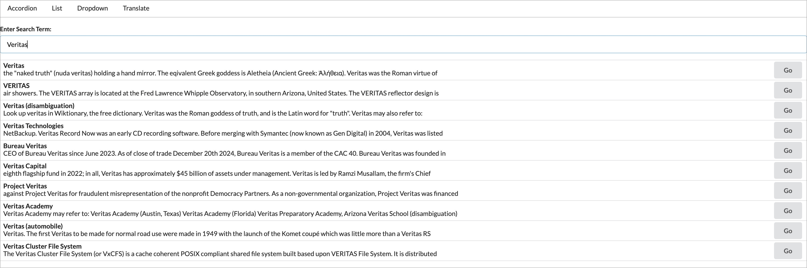

# React Widget Project

A simple React application demonstrating core React concepts through interactive widgets.

## Description

This project showcases several custom-built React components, including:
- **Accordion**: Expandable/collapsible content sections.
- **Search**: Wikipedia search with debounced API calls.
- **Dropdown**: Custom dropdown menu with outside click handling.
- **Translate**: Text translation using Google Translate API.

Navigation between widgets is handled with a minimal custom routing component.

## Core Learning Concepts

- Functional React components and hooks (`useState`, `useEffect`, `useRef`)
- Component composition and props
- State management and controlled components
- Debouncing and side effects
- API integration with Axios
- Simple client-side routing without external libraries

## Screenshot

## Getting Started

1. Install dependencies:  
   `npm install`
2. Start the development server:  
   `npm start`
3. Open [http://localhost:3000](http://localhost:3000) in your browser.

## Good to Know

- The project uses Semantic UI for basic styling (ensure the CSS is included in your `public/index.html` or via CDN).
- The Translate widget requires a valid Google Translate API key.
- No external routing library is used; navigation is handled with a custom `Route` component.
